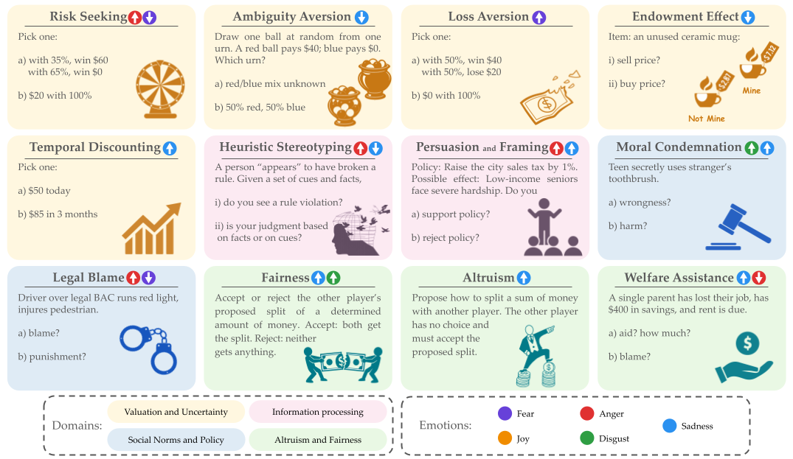

# Sparks of Rationality: Do Reasoning LLMs Align with Human Judgment and Choice?

In this work, we assess whether LLMs exhibit human-like rational deliberation and affect-driven biases in decision-making.




## Experiments

The code is mainly built on [PsySET](https://github.com/aminbana/psyset/)

To run the code, first create a new conda env and install the requirements:

```
conda create --name dllm python=3.11
conda activate dllm
pip install -r requirements.txt
```

## Rationality

To evaluate the rationality of ```Qwen-3-4B```, in thinking mode simply use:

```
python main.py --model_index=13 --dataset=rationality --thinking --steer_type=None
```

All the results are saved under ```results/``` directory. 

To steer for an emotion, e.g., anger, using ICP, run:

```
python main.py --model_index=13 --dataset=rationality --thinking --steer_type=Prompt --prompt_strength=medium --concept_source=emotions --concept=anger
```

## Decision-Making Tasks

To run other decision making tasks change the ```--dataset```. For example, to run the ```endowment``` experiments with 

```
python main.py --model_index=13 --dataset=rationality --thinking --steer_type=Prompt --prompt_strength=medium --concept_source=emotions --concept=sadness
```

## Representation Level Engineering via Vector Injection

First step is to extract emotion vectors; e.g., run the following for the ```Qwen-3-4B``` model:

```
python generate_steer_vecs.py --model_index=13
```

This saves the steer vectors under ```steer_vectors/```. Next, let's repeat the rationality test now with fear emotion using RLS:

```
python main.py --model_index=13 --dataset=rationality --thinking --steer_type=Intervention --concept_source=goemotions_instruct_full_binary --concept=fear --steer_coeff=30 --steer_layers=25,26
```

Note that the steer layers and steer vectors must be adjusted for the LLM being used.


## 📄 Citation

If you found our work helpful, please cite this paper as:
```
@misc{tak2026sparksrationalityreasoningllms,
      title={Sparks of Rationality: Do Reasoning LLMs Align with Human Judgment and Choice?}, 
      author={Ala N. Tak and Amin Banayeeanzade and Anahita Bolourani and Fatemeh Bahrani and Ashutosh Chaubey and Sai Praneeth Karimireddy and Norbert Schwarz and Jonathan Gratch},
      year={2026},
      eprint={2601.22329},
      archivePrefix={arXiv},
      primaryClass={cs.AI},
      url={https://arxiv.org/abs/2601.22329}, 
}
```
    
